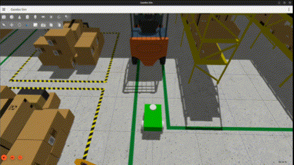

# ROAM — Reactive Obstacle Avoidance Module
ROAM is ROS2 reactive obstacle avoidance controller for a mobile robot using 2D LiDAR. The system processes raw LaserScan data to perform real-time, state-based motion control without global planning.

## Features
- Reactive obstacle avoidance using 2D LiDAR (LaserScan)
- Sector-based perception with NaN/INF handling
- State-based control with hysteresis (cruise/slow/blocked)
- Directional bias and recovery behaviors (reverse + rotate)
- Fully parameterized ROS 2 node

## Limitations
- The controller is purely reactive and does not perform global planning or mapping.
- Perception is limited to a single 2D LiDAR plane, making obstacles above or below the scan height invisible.

## Usage
```bash
colcon build
source install/setup.bash
ros2 launch roam_description roam_simulation.xml
```

## Parameters
- forward_angle (deg)
- stop_dist (m)
- slow_dist (m)
- resume_dist (m)
- cruise_spd (m/s)
- rotate_spd (rad/s)
- 
## Demo


Full-length demo video available in `media/roam_demo.mp4`.
